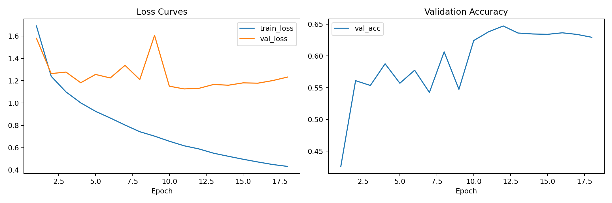
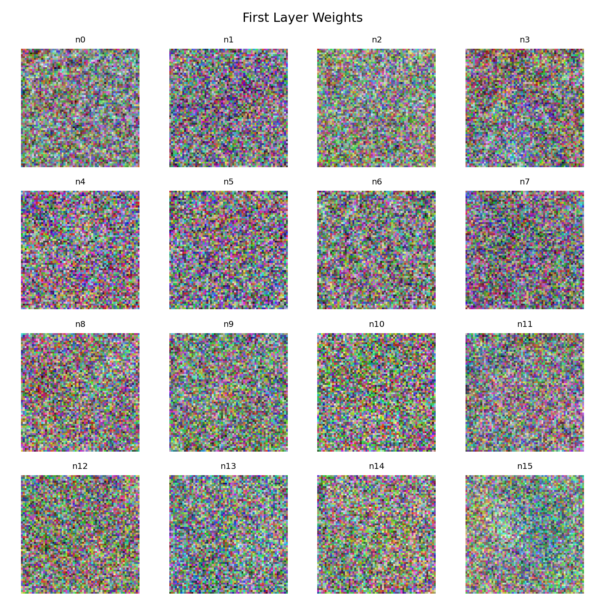
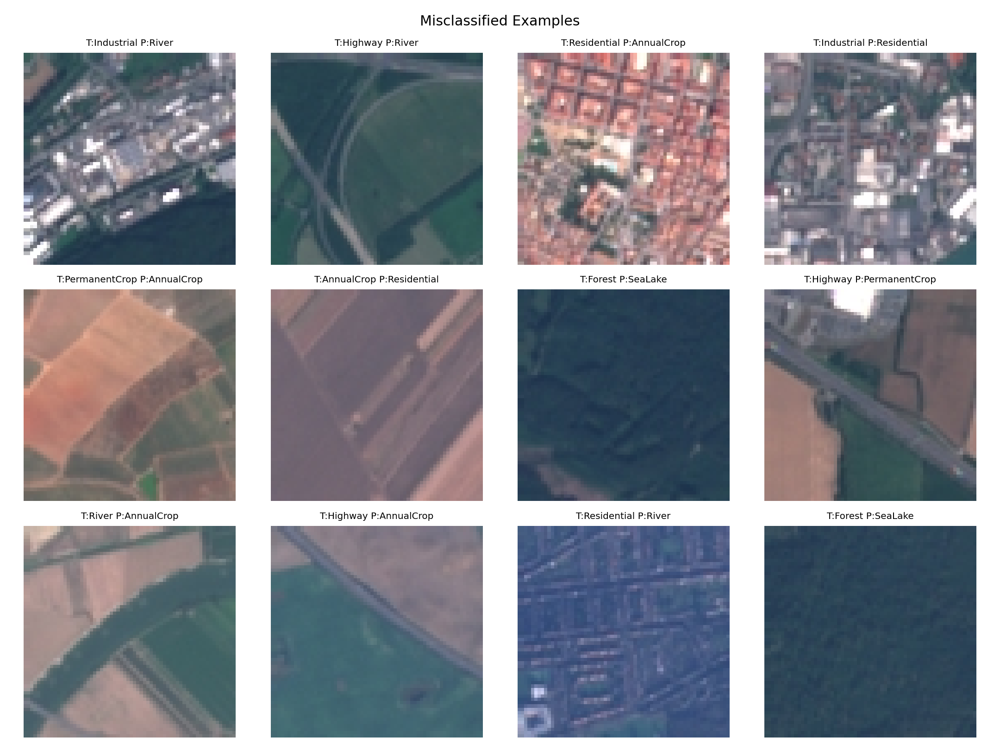

# HW1：基于 NumPy 从零实现 MLP 的 EuroSAT 地表覆盖分类

> 提交前请补全以下两项链接：
>
> - GitHub 仓库链接：`TODO`
> - 模型权重下载链接：[`TODO`](https://drive.google.com/file/d/1IqamaLg3IYoW295HQ7ZP8d8MNo8WXxri/view?usp=drive_link)

## 任务描述

本次作业要求从零开始实现一个三层 MLP 分类器，并将其应用于 EuroSAT RGB 遥感图像数据集，完成地表覆盖分类任务。按照作业要求，整个实现过程中不能使用 PyTorch、TensorFlow、JAX 等带自动微分功能的深度学习框架，因此本实验中的前向传播、反向传播、损失函数、参数更新和训练流程均使用 NumPy 自主实现。

数据集位于 `EuroSAT_RGB/` 目录下，共包含 10 个类别：

- AnnualCrop
- Forest
- HerbaceousVegetation
- Highway
- Industrial
- Pasture
- PermanentCrop
- Residential
- River
- SeaLake

这些类别覆盖了常见的农业、植被、水体和人工地物场景，能够较好地检验模型对遥感图像纹理、颜色和空间结构的识别能力。

## 代码结构

本次提交的代码按照作业要求划分为多个模块，主要包括以下部分：

- 数据加载与预处理：`src/data.py`
- 模型定义：`src/model.py`
- 训练与优化：`src/train_utils.py`
- 测试评估：`src/eval_utils.py`、`test.py`
- 超参数搜索：`search.py`

此外，还包含以下辅助模块：

- 自动微分与反向传播：`src/autograd.py`
- 可视化脚本：`src/viz.py`、`visualize.py`
- 主训练脚本：`train.py`

整体上，代码已经覆盖了作业要求中的五个核心模块：数据处理、模型定义、训练循环、测试评估和超参数查找。

### 网络结构

本实验使用的是三层 MLP。这里的“三层”指的是三个带可学习参数的全连接层，不将输入层单独计入网络层数。因此，该模型实际包含两个隐藏层和一个输出层，结构如下：

1. 输入层 -> 隐藏层 1
2. 隐藏层 1 -> 隐藏层 2
3. 隐藏层 2 -> 输出层

最终表现最好的网络配置为：

- 输入维度：`64 x 64 x 3 = 12288`
- 隐藏层 1 大小：`224`
- 隐藏层 2 大小：`112`
- 输出类别数：`10`
- 激活函数：`ReLU`

由于该模型直接对展平后的像素向量进行分类，因此它对颜色分布和局部纹理较为敏感，但对复杂空间结构的建模能力相对有限。

### 损失函数与优化方法

训练过程中使用交叉熵损失函数，并结合 L2 正则化抑制过拟合。整体损失可写为：

\[
\mathcal{L} = \mathcal{L}_{CE} + \lambda \sum ||W||_2^2
\]

其中：

- `L_CE` 表示交叉熵损失
- `lambda` 表示正则化系数
- 本实验最佳模型中 `lambda = 1e-4`

优化器采用最基础的 SGD，并使用学习率衰减策略：

- 初始学习率：`0.015`
- 每个 epoch 衰减系数：`0.95`
- batch size：`64`
- 训练轮数：`18`

### 数据预处理

为了保证训练稳定性，本实验对数据进行了如下处理：

- 将所有图像统一调整为 `64 x 64`
- 像素值缩放到 `[0, 1]`
- 基于训练集统计每个通道的均值和标准差
- 对训练集、验证集和测试集进行标准化
- 采用分层采样划分训练集、验证集和测试集

这种处理方式可以减少不同通道之间的分布差异，有助于提升训练稳定性和最终分类性能。

## 超参数搜索

根据作业要求，我对学习率、隐藏层大小、batch size、weight decay 和训练轮数等超参数进行了多组实验。搜索过程中主要围绕以下参数展开：

- 学习率 `lr`
- 第一隐藏层维度 `hidden1`
- 第二隐藏层维度 `hidden2`
- 正则化强度 `weight_decay`
- batch size
- epoch 数

部分代表性实验结果如下表所示：

| 实验目录 | Hidden1 | Hidden2 | 学习率 | Batch Size | Weight Decay | Epochs | 最佳验证集准确率 |
| --- | ---: | ---: | ---: | ---: | ---: | ---: | ---: |
| `outputs` | 128 | 64 | 0.020 | 64 | 1e-4 | 12 | 0.6252 |
| `tune_relu_256_128_lr0015` | 256 | 128 | 0.015 | 64 | 1e-4 | 15 | 0.6344 |
| `tune_relu_192_96_lr002` | 192 | 96 | 0.020 | 64 | 1e-4 | 15 | 0.6360 |
| `tune_relu_256_128_lr001_wd5e4` | 256 | 128 | 0.010 | 64 | 5e-4 | 15 | 0.6339 |
| `tune_relu_192_96_lr0015` | 192 | 96 | 0.015 | 64 | 1e-4 | 18 | 0.6351 |
| `tune_relu_192_96_lr002_batch32` | 192 | 96 | 0.020 | 32 | 1e-4 | 15 | 0.6397 |
| `tune_relu_224_112_lr0015` | 224 | 112 | 0.015 | 64 | 1e-4 | 18 | **0.6472** |

从实验结果可以看出：

- 过大的学习率容易导致训练不稳定，甚至出现损失为 `nan` 的情况
- 适当增大隐藏层维度能够提升模型表达能力，但如果学习率不合适也容易过拟合或震荡
- `ReLU` 在当前任务上的效果明显优于更保守的设置
- 在当前实验中，`hidden1=224`、`hidden2=112`、`lr=0.015` 的组合取得了最好的验证集表现

因此，最终选择 `tune_relu_224_112_lr0015` 作为本次实验的最终模型。

## 最终实验结果

最终选定的实验目录为：

- `tune_relu_224_112_lr0015/`

对应结果如下：

- 最佳验证集准确率：`0.6472`
- 测试集准确率：`0.6378`
- 测试集分类错误样本数：`1467`

测试相关输出文件包括：

- `tune_relu_224_112_lr0015/test_metrics.json`
- `tune_relu_224_112_lr0015/confusion_matrix.npy`
- `tune_relu_224_112_lr0015/confusion_matrix.png`

整体来看，该模型已经能够学习到较稳定的类别区分能力，但受限于 MLP 对空间结构建模能力较弱，最终准确率仍有进一步提升空间。

## 训练过程可视化

按照作业要求，我对训练集和验证集的 loss 曲线，以及验证集准确率曲线进行了可视化，结果保存在：

- `tune_relu_224_112_lr0015/training_curves.png`

图像如下：

从训练曲线中可以观察到：

- 前几个 epoch 中训练损失和验证损失下降较快，说明模型较快学到了有效特征
- 验证集准确率在前期上升明显，后期趋于平稳
- 最佳验证集准确率出现在第 12 个 epoch 左右
- 后续训练中训练准确率继续提高，但验证准确率提升有限，说明模型开始出现轻微过拟合

因此，从结果上看，当前模型在训练后期已经接近其结构能力上限。

## 权重可视化与空间模式观察

根据作业要求，我对第一层隐藏层的权重进行了可视化。相关结果保存在：

- `tune_relu_224_112_lr0015/first_layer_weights.png`

图像如下：

对这些权重图进行观察后，可以得到以下结论：

- 一部分权重呈现明显的绿色偏好，说明模型在提取与植被相关的颜色特征
- 一部分权重对蓝色或蓝绿色区域更敏感，可能用于识别 `River` 和 `SeaLake` 等水体类别
- 少数权重表现出条带状、边缘状或方向性纹理，可能与 `Highway`、`Industrial`、`Residential` 等人工地物的结构特征有关
- 整体而言，第一层学习到的特征更偏向于低层次颜色模式和简单纹理，而不是更高层的语义结构

这与 MLP 的模型特性是一致的。因为输入是展平后的像素向量，模型难以像卷积网络那样直接保留局部空间邻接关系，因此更容易依赖颜色分布和粗粒度纹理进行分类。

##  错例分析

错分样本及其预测结果保存在：

- `tune_relu_224_112_lr0015/errors.json`
- `tune_relu_224_112_lr0015/error_examples.png`

图像如下：

根据混淆矩阵，几个比较明显的混淆类别如下：

- `HerbaceousVegetation -> PermanentCrop`：`75`
- `Highway -> River`：`71`
- `PermanentCrop -> AnnualCrop`：`66`
- `AnnualCrop -> PermanentCrop`：`61`
- `Forest -> SeaLake`：`56`
- `Residential -> PermanentCrop`：`45`

这些错分现象的原因大致可以归纳为以下几点：

1. `Highway` 和 `River` 在遥感图像中都可能表现为细长、连续的带状结构，尤其是在局部区域中，两者的形状非常相似，因此容易混淆。
2. `AnnualCrop`、`PermanentCrop`、`Pasture` 和 `HerbaceousVegetation` 都属于植被或农田相关类别，在颜色和纹理上高度接近，因此模型很难仅凭展平像素完成精确区分。
3. `Residential` 与 `Industrial`、`PermanentCrop` 之间也存在混淆，说明在某些图像块中，道路、屋顶、裸地和规则纹理之间具有一定相似性。
4. `Forest` 和 `SeaLake` 的部分样本被误分，说明当颜色较暗或者局部纹理不明显时，MLP 对全局空间关系的利用不够充分。

结合具体样本还可以发现：

- 某些 `Highway` 图像周围背景复杂，导致模型更关注线状结构而忽略上下文，因此被分到 `River`
- 某些 `PermanentCrop` 图像呈现出较规则的农田纹理，因此容易被分成 `AnnualCrop`
- 某些 `Residential` 图像中建筑密度较低，反而更接近其他土地利用类型的统计特征

总体上，这些错误具有一定合理性，也说明当前从零实现的浅层 MLP 已经学到了一部分有效特征，但在细粒度类别区分上仍受模型结构限制。

